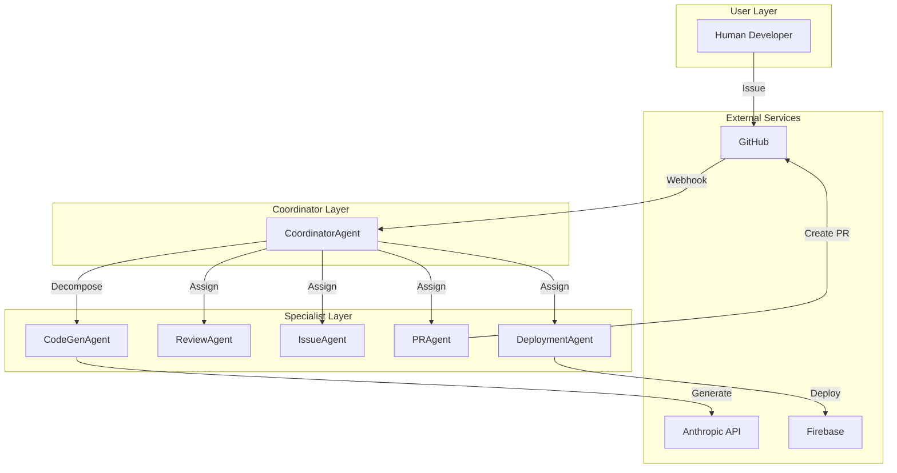
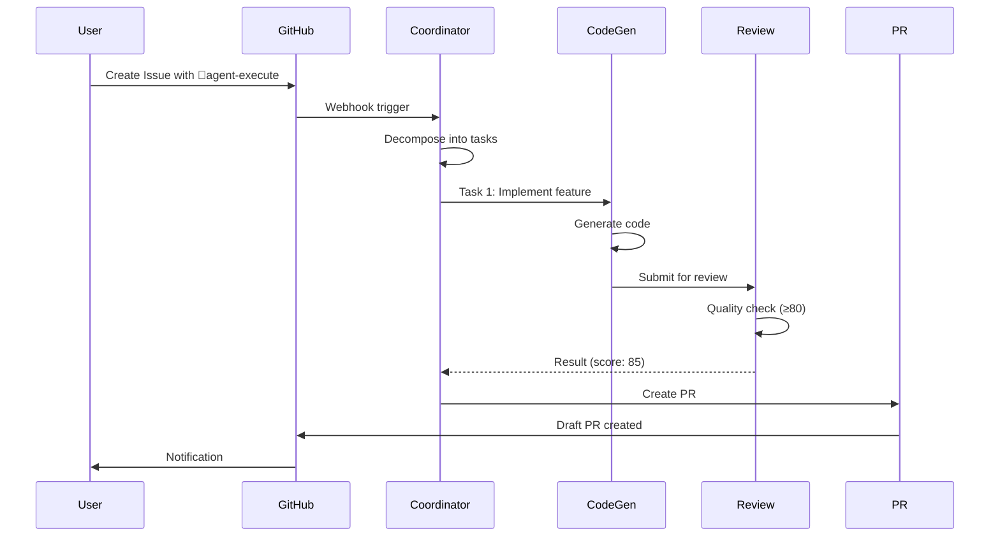

# Generate Docs Command

TypeScriptコードからAPIドキュメント、README、アーキテクチャ図を自動生成します。

## 使用方法

```bash
/generate-docs [type]
```

## パラメータ

- `type` (オプション): 生成するドキュメントタイプ
  - `all` (デフォルト): すべてのドキュメント生成
  - `api`: API リファレンス (TypeDoc)
  - `readme`: README.md 更新
  - `architecture`: アーキテクチャ図生成
  - `changelog`: CHANGELOG.md 生成

## 実行内容

### 1. API リファレンス生成 (TypeDoc)

```bash
npx typedoc --out docs/api src/
```

生成されるドキュメント:

```
docs/api/
├── index.html              # エントリーポイント
├── classes/
│   ├── BaseAgent.html
│   ├── CoordinatorAgent.html
│   └── CodeGenAgent.html
├── interfaces/
│   ├── Task.html
│   ├── AgentResult.html
│   └── QualityReport.html
├── modules/
│   └── types.html
└── assets/
    ├── style.css
    └── search.js
```

**アクセス**: `open docs/api/index.html`

### 2. README.md 自動更新

コードベースを分析し、README.mdを更新:

```markdown
# Project Name

## 📊 Project Stats

- **Total Files**: 234
- **Lines of Code**: 12,450
- **Test Coverage**: 85%
- **TypeScript**: 100%
- **Dependencies**: 258

## 🏗️ Architecture

<architecture-diagram>

## 📦 Modules

### Core Agents (agents/)

#### CoordinatorAgent
Orchestrates task decomposition and agent assignment.

**Methods**:
- `decomposeIssue(issue: Issue): Promise<TaskDecomposition>`
- `buildDAG(tasks: Task[]): Promise<DAG>`
- `assignAgent(task: Task): Promise<AgentType>`

**Dependencies**:
- Octokit (GitHub API)
- Anthropic SDK

#### CodeGenAgent
Generates code using Claude Sonnet 4.

**Methods**:
- `execute(task: Task): Promise<AgentResult>`
- `generateCode(spec: CodeSpec): Promise<GeneratedCode>`

...

## 📚 API Documentation

Full API documentation: [docs/api/](./docs/api/index.html)

## 🧪 Testing

```bash
npm test              # Run tests
npm run test:coverage # With coverage
```

## 📝 Contributing

コントリビューションについては、プロジェクトルートの CONTRIBUTING.md または GitHubの標準的なコントリビューションガイドラインを参照してください。
```

### 3. アーキテクチャ図生成

Mermaid記法でアーキテクチャ図を生成:

#### システム構成図



#### データフロー図



### 4. CHANGELOG.md 生成

Git コミット履歴から自動生成:

```markdown
# Changelog

All notable changes to this project will be documented in this file.

The format is based on [Keep a Changelog](https://keepachangelog.com/en/1.0.0/),
and this project adheres to [Semantic Versioning](https://semver.org/spec/v2.0.0.html).

## [Unreleased]

### Added
- New feature: User profile editing (#123)
- Agent: DeploymentAgent auto-rollback

### Changed
- Updated lodash to 4.17.21 for security
- Improved CoordinatorAgent DAG algorithm

### Fixed
- Fixed: Login token refresh issue (#124)
- Fixed: Type errors in deployment config

### Security
- Patched XSS vulnerability in UserProfile component

## [1.2.0] - 2025-10-08

### Added
- Agent system implementation
- GitHub Actions integration
- Claude Code optimization

### Changed
- Migrated from JavaScript to TypeScript
- Updated testing framework to Vitest

## [1.1.0] - 2025-09-15

### Added
- Initial agent implementation
- Basic CI/CD pipeline

## [1.0.0] - 2025-09-01

### Added
- Initial release
- Core functionality
```

## 実行例

### 基本的な使用方法

```bash
# すべてのドキュメントを生成
/generate-docs all

# 特定のタイプのみ生成
/generate-docs api
/generate-docs readme
/generate-docs architecture
/generate-docs changelog
```

### 出力例

**すべてのドキュメント生成**:
```
📚 Generate Docs - All

1. API Reference (TypeDoc)
   ✅ docs/api/index.html
   📄 234 files documented

2. README.md Update
   ✅ README.md updated
   📊 Stats: 234 files, 12,450 LOC, 85% coverage

3. Architecture Diagrams
   ✅ docs/ARCHITECTURE.md
   📊 3 diagrams generated

4. CHANGELOG.md
   ✅ CHANGELOG.md generated
   📝 25 commits processed

✅ Documentation Generated
Duration: 1m 23s
```

詳細な出力例については、各コマンドを実行して確認してください。

## TypeDoc 設定

TypeDocの設定ファイルはプロジェクトルートの `typedoc.json` を参照してください。

`package.json` には以下のスクリプトが含まれます:

```json
{
  "scripts": {
    "docs:api": "typedoc",
    "docs:serve": "npx http-server docs/api -p 8080 -o"
  }
}
```

## JSDoc ドキュメント

JSDocのベストプラクティスについては、プロジェクトのドキュメント標準に従ってください。
一般的なガイドラインは [JSDoc Official Documentation](https://jsdoc.app/) を参照してください。

## Mermaid 図

アーキテクチャ図やデータフロー図の生成にはMermaid記法を使用します。
詳細は [Mermaid Documentation](https://mermaid.js.org/) を参照してください。

## CI/CD統合

GitHub Actions での自動生成については、`.github/workflows/` ディレクトリの設定ファイルを参照してください。

## トラブルシューティング

### よくある問題

**TypeDoc エラー**:
```bash
npm update typedoc
rm -rf node_modules/.cache
```

**Mermaid 図が表示されない**: GitHub markdownで ```mermaid ブロックを使用してください

**CHANGELOG が空**: Conventional Commits形式（`feat:`, `fix:` 等）でコミットしているか確認してください

## 関連ドキュメント

- [TypeDoc Documentation](https://typedoc.org/)
- [Mermaid Documentation](https://mermaid.js.org/)
- [Keep a Changelog](https://keepachangelog.com/)
- [JSDoc Documentation](https://jsdoc.app/)
